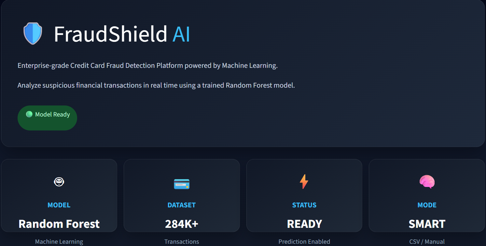
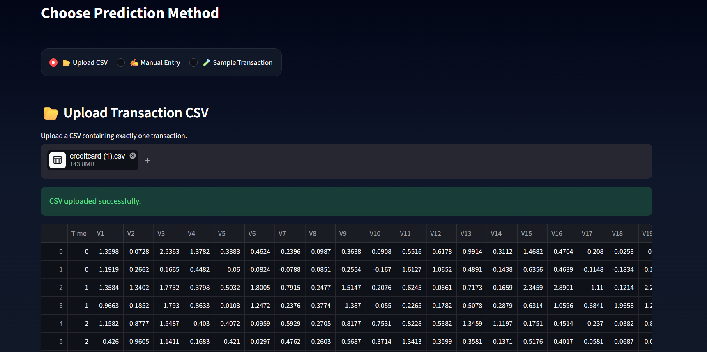
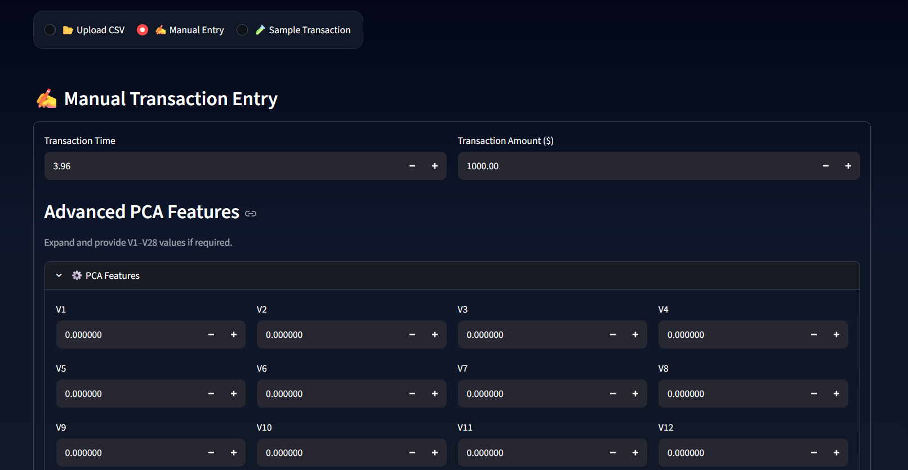
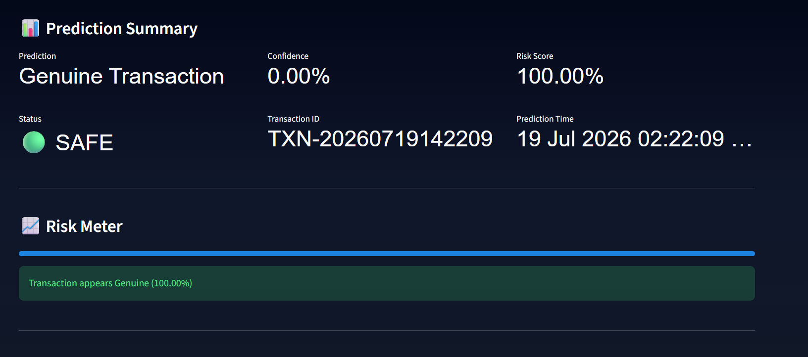
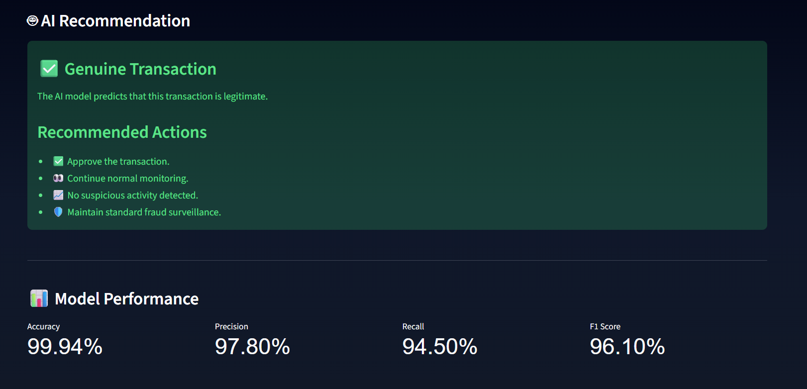
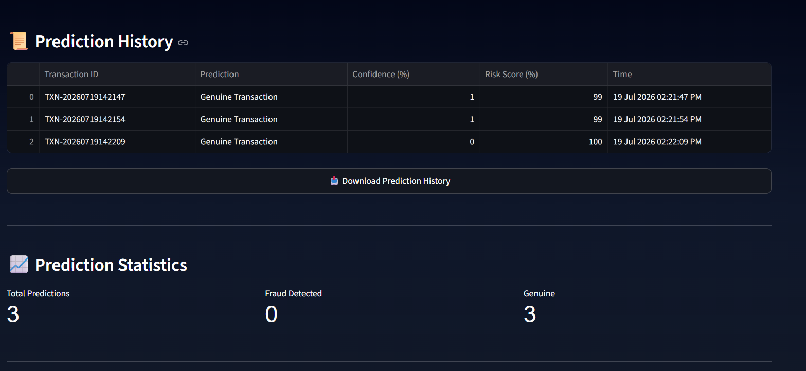

# 🛡️ FraudShield AI

> **AI-Powered Credit Card Fraud Detection System using Machine Learning and Streamlit**

FraudShield AI is a modern web application that detects fraudulent credit card transactions in real time using a trained **Random Forest Machine Learning model**. The system allows users to analyze transactions through **CSV upload**, **manual input**, or **sample transactions**, and provides instant fraud predictions, confidence scores, risk assessment, and AI-based recommendations.

---

## 📌 Table of Contents

- Project Overview
- Features
- Technology Stack
- Machine Learning Model
- Project Architecture
- Installation
- How to Run
- Screenshots
- Future Scope
- Author

---

# 📖 Project Overview

Financial fraud has become one of the biggest challenges in digital payments. Millions of online transactions occur every day, making it difficult to identify fraudulent activities manually.

**FraudShield AI** solves this problem by using Machine Learning to classify transactions as **Fraudulent** or **Genuine** within seconds.

The application provides an interactive dashboard where users can:

- 📂 Upload transaction CSV files
- ✍️ Enter transaction details manually
- 🧪 Test using sample transactions
- 📊 View confidence score
- 📈 Analyze fraud risk
- 🤖 Receive AI recommendations
- 📜 Store prediction history
- 📥 Download prediction reports

---

## 🎯 Objectives

- Detect fraudulent credit card transactions in real time.
- Reduce financial losses caused by fraud.
- Provide a simple and interactive user interface.
- Demonstrate the practical use of Machine Learning in financial security.
- Build an end-to-end AI application using Python and Streamlit.

---

## ⭐ Key Highlights

- 🚀 Real-Time Prediction
- 🤖 Random Forest Machine Learning Model
- 📂 CSV Upload Support
- ✍️ Manual Transaction Analysis
- 🧪 Sample Transaction Testing
- 📊 Confidence Score
- 📈 Risk Meter
- 🤖 AI Recommendation System
- 📜 Prediction History
- 📥 Download Prediction Report
- 🌙 Modern Responsive Dashboard

---

# ✨ Features

FraudShield AI provides a modern and user-friendly interface with powerful fraud detection capabilities.

### 🔍 Fraud Detection
- Detects fraudulent credit card transactions instantly.
- Predicts whether a transaction is **Fraudulent** or **Genuine**.

### 📂 Multiple Input Methods
- Upload transaction through CSV.
- Manual transaction entry.
- Built-in sample transaction for testing.

### 📊 Prediction Dashboard
- Prediction Summary
- Confidence Score
- Risk Score
- Transaction Status
- Transaction ID
- Prediction Time

### 🤖 AI Recommendation
- Intelligent recommendations based on prediction results.
- Suggested actions for fraudulent transactions.
- Guidance for genuine transactions.

### 📜 Prediction History
- Stores every prediction during the session.
- Displays history in a table.
- Export history as CSV.

### 🎨 Modern User Interface
- Premium Dark Theme
- Responsive Layout
- Interactive Dashboard
- Easy-to-use Interface

---

# 🛠️ Technology Stack

| Category | Technology |
|-----------|------------|
| Language | Python |
| Framework | Streamlit |
| Machine Learning | Scikit-Learn |
| Model | Random Forest Classifier |
| Data Processing | Pandas, NumPy |
| Dataset | Credit Card Fraud Detection Dataset |
| Version Control | Git & GitHub |

---

# 🤖 Machine Learning Model

The application uses the **Random Forest Classifier**, a powerful ensemble learning algorithm suitable for classification tasks.

### Why Random Forest?

- High accuracy
- Handles imbalanced datasets effectively
- Reduces overfitting
- Fast prediction
- Robust performance

### Model Workflow

1. Load trained model.
2. Receive transaction details.
3. Preprocess input.
4. Predict transaction class.
5. Calculate confidence score.
6. Display fraud risk.
7. Provide AI recommendation.

---
# 🏗️ Project Architecture

```
                User
                  │
                  ▼
      ┌───────────────────────┐
      │   Streamlit Dashboard │
      └───────────────────────┘
                  │
                  ▼
      ┌───────────────────────┐
      │   Input Validation    │
      └───────────────────────┘
                  │
                  ▼
      ┌───────────────────────┐
      │ Random Forest Model   │
      └───────────────────────┘
                  │
                  ▼
      ┌───────────────────────┐
      │ Prediction & Analysis │
      └───────────────────────┘
                  │
                  ▼
      ┌───────────────────────┐
      │ Dashboard + Reports   │
      └───────────────────────┘
```

---

# 📂 Project Structure

```
FraudShield-AI/
│
├── app.py
├── streamlit_app.py
├── requirements.txt
├── README.md
├── model.pkl
├── sample_transaction.csv
├── screenshots/
│   ├── home.png
│   ├── upload.png
│   ├── fraud_prediction.png
│   └── genuine_prediction.png
└── LICENSE
```

---

# ⚙️ Installation

Clone the repository:

```bash
git clone https://github.com/Neeraj123125/FraudShield-AI.git
```

Move into the project folder:

```bash
cd FraudShield-AI
```

Install dependencies:

```bash
pip install -r requirements.txt
```

Run the application:

```bash
streamlit run streamlit_app.py
```

The application will open automatically in your browser.

---

# 🚀 How to Use

### Option 1 – Upload CSV

- Select **Upload CSV**
- Upload a transaction CSV file
- Click **Analyze**
- View prediction results

### Option 2 – Manual Entry

- Select **Manual Entry**
- Fill transaction details
- Click **Analyze**
- View fraud prediction

### Option 3 – Sample Transaction

- Select **Sample Transaction**
- Click **Analyze**
- Observe prediction and recommendation

---

# 📸 Application Screenshots

The following screenshots demonstrate the key functionalities and user interface of the FraudShield AI application.

---

## 🏠 Home Dashboard



The home dashboard provides an overview of the application, including the project introduction, model information, dataset details, prediction status, and supported prediction methods.

---

## 📂 CSV Upload



Users can upload a CSV file containing credit card transaction details. The application validates the file and performs fraud detection using the trained Machine Learning model.

---

## ✍️ Manual Transaction Entry



The application allows users to manually enter transaction information, including PCA features and transaction amount, making it easy to test custom transactions.

---

## 📊 Prediction Summary & Risk Assessment



After analyzing a transaction, the dashboard displays:

- Prediction Result
- Confidence Score
- Risk Score
- Transaction Status
- Transaction ID
- Prediction Time
- Risk Meter

This provides users with a clear understanding of the prediction outcome.

---

## 🤖 AI Recommendation & Model Performance



Based on the prediction result, FraudShield AI provides intelligent recommendations to help users make informed decisions.

The dashboard also displays model performance metrics such as:

- Accuracy
- Precision
- Recall
- F1 Score

---

## 📜 Prediction History



Every analyzed transaction is stored in the prediction history table.

Users can:

- View previous predictions
- Track transaction details
- Download prediction history as a CSV report

---

# 🔮 Future Scope

FraudShield AI can be further enhanced with several advanced features:

- 🌐 Cloud Deployment using AWS, Azure, or Google Cloud
- 🤖 Deep Learning based Fraud Detection Models
- 📈 Real-Time Transaction Monitoring
- 📱 Mobile Application Support
- 🔔 Email and SMS Fraud Alerts
- 🔐 User Authentication and Role-Based Access
- 🗄️ Database Integration for Persistent Storage
- 📊 Advanced Analytics Dashboard
- 🔄 Automatic Model Retraining using New Data
- 🌍 REST API Integration for Banking Applications

---
# 👨‍💻 About the Author

## Neeraj Yadav

🎓 B.Tech (Computer Science & Engineering – Data Science)

📊 Aspiring Data Analyst | Machine Learning Enthusiast

Passionate about building intelligent data-driven applications using Python, Machine Learning, and Data Analytics. Interested in solving real-world problems through predictive modeling and data visualization.

- 💻 GitHub: https://github.com/Neeraj123125
- 💼 LinkedIn: https://www.linkedin.com/in/neerajyadav001/

---

# 🤝 Contribution

Contributions, suggestions, and feature requests are welcome.

If you'd like to contribute:

1. Fork this repository.
2. Create a feature branch.
3. Commit your changes.
4. Push to your branch.
5. Open a Pull Request.

---

# 🙏 Acknowledgements

This project was developed as part of the **IBM SkillsBuild Internship Program**.

Special thanks to:

- IBM SkillsBuild
- Streamlit
- Scikit-learn
- Pandas
- NumPy
- Python Open Source Community

---

# ⭐ Support

If you found this project useful, please consider giving it a **⭐ Star** on GitHub.

---

# 📄 License

This project is intended for educational and learning purposes.

© 2026 Neeraj Yadav. All Rights Reserved.

